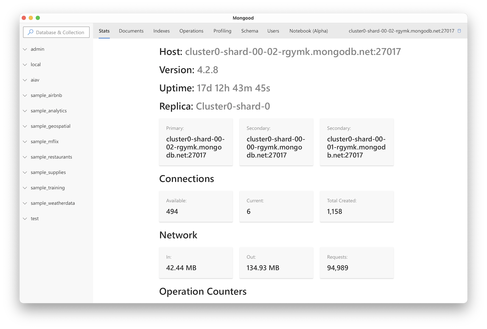
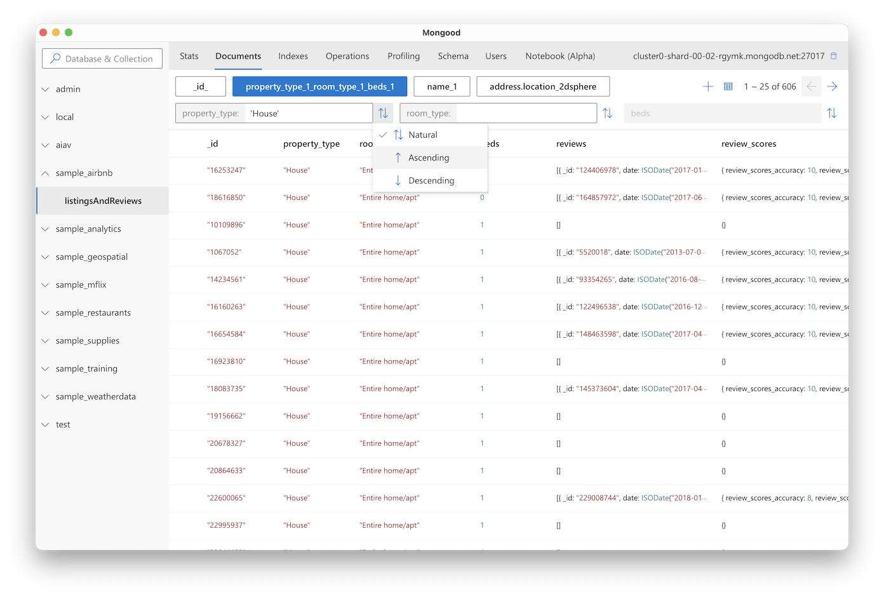
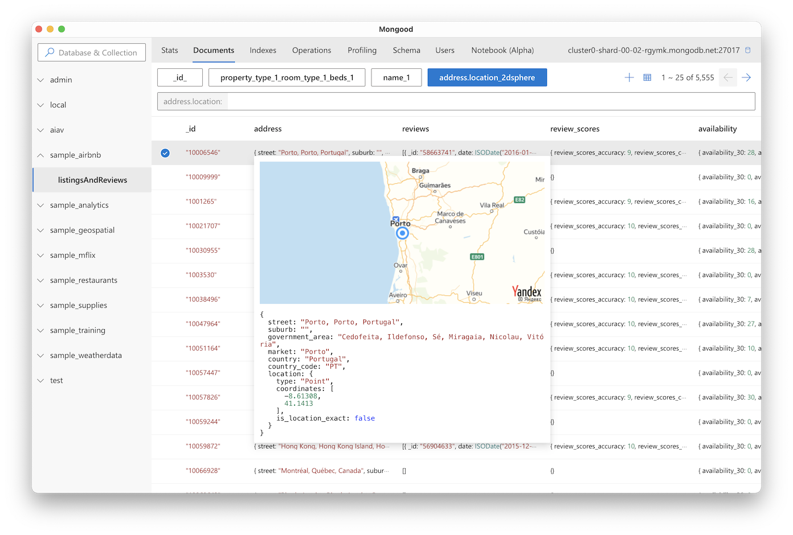
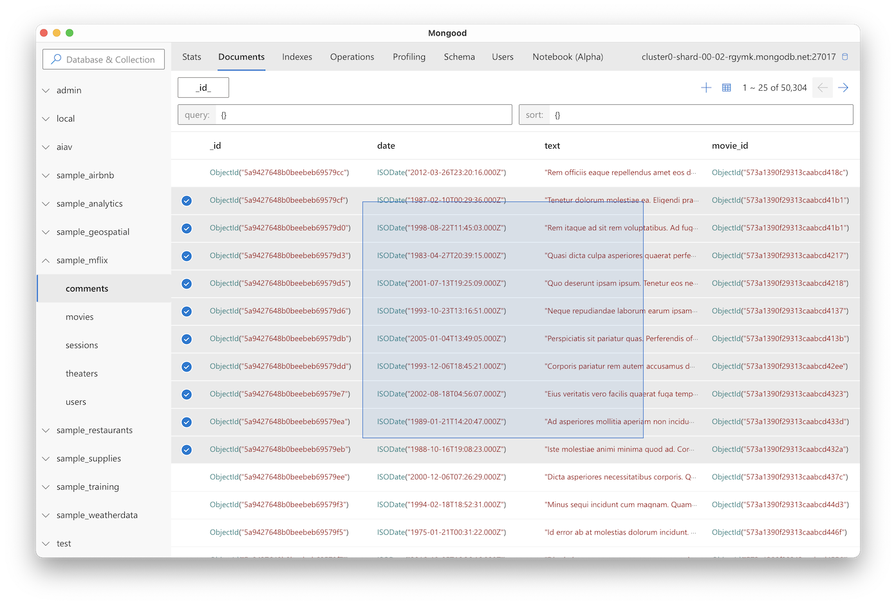
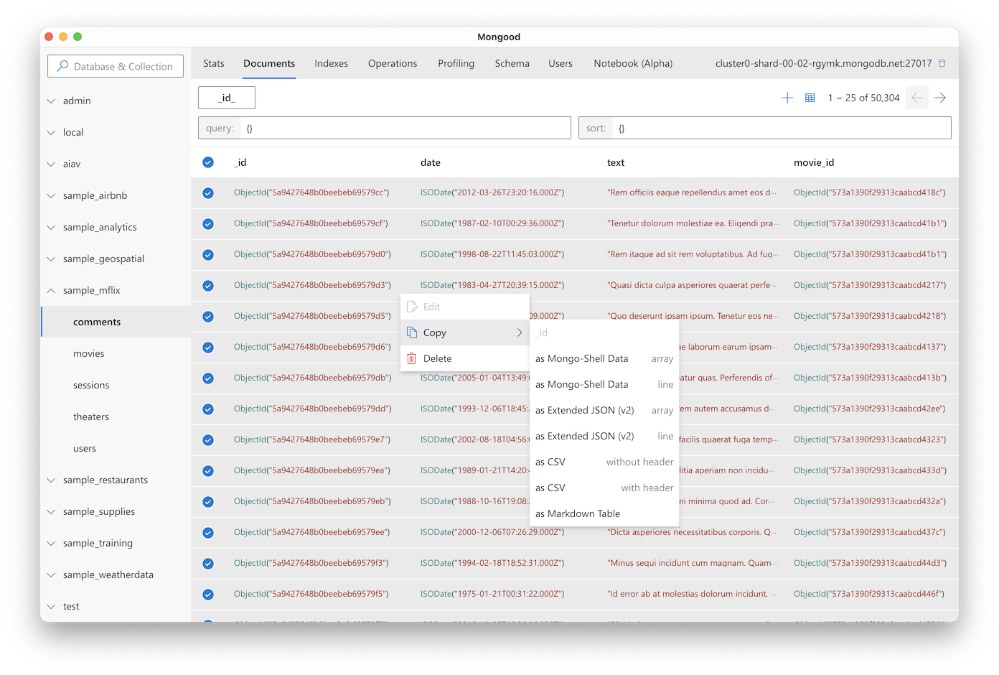
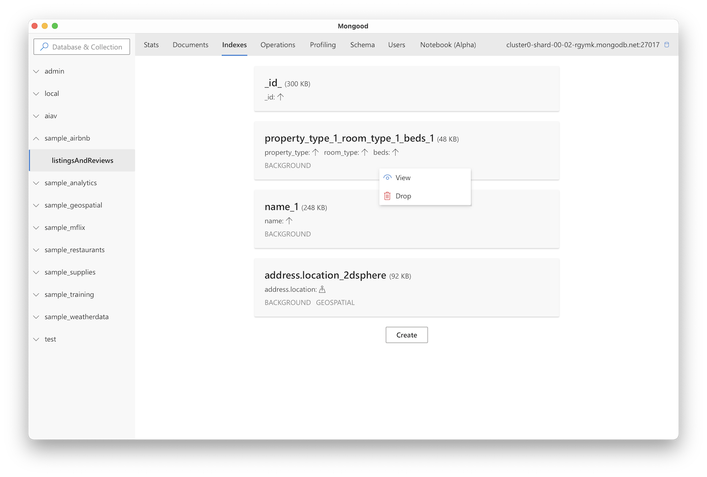
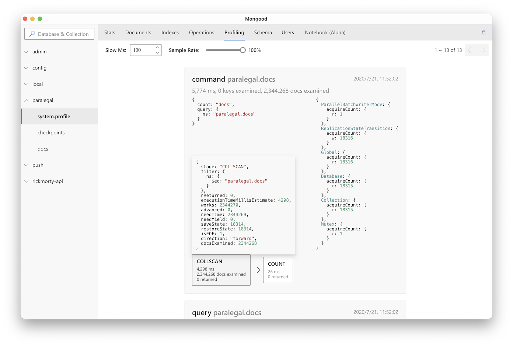
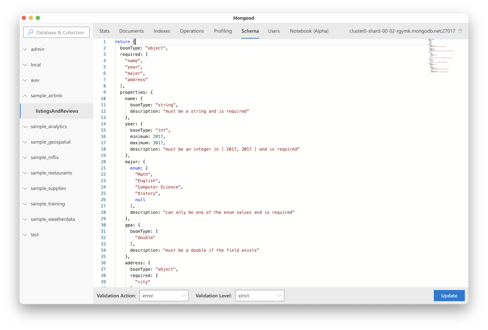
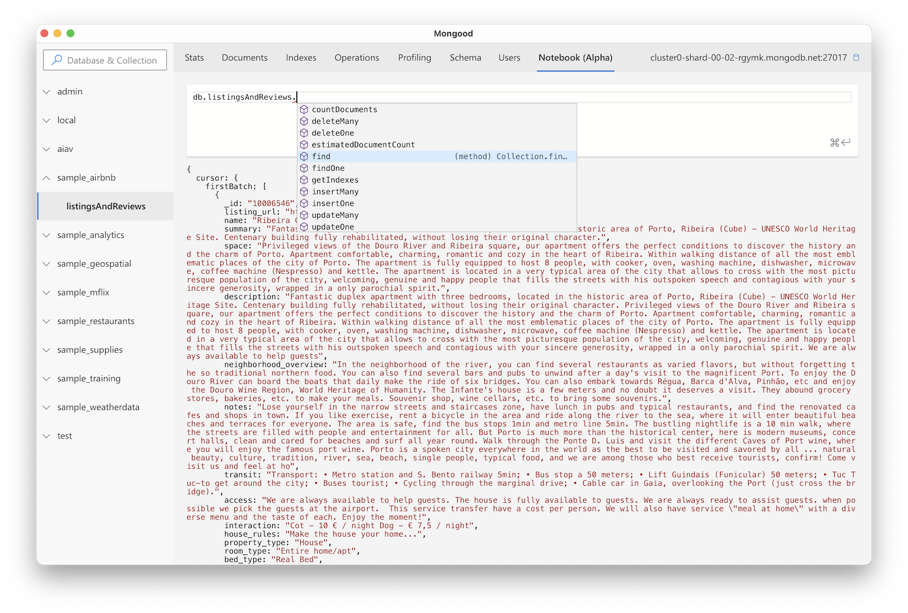
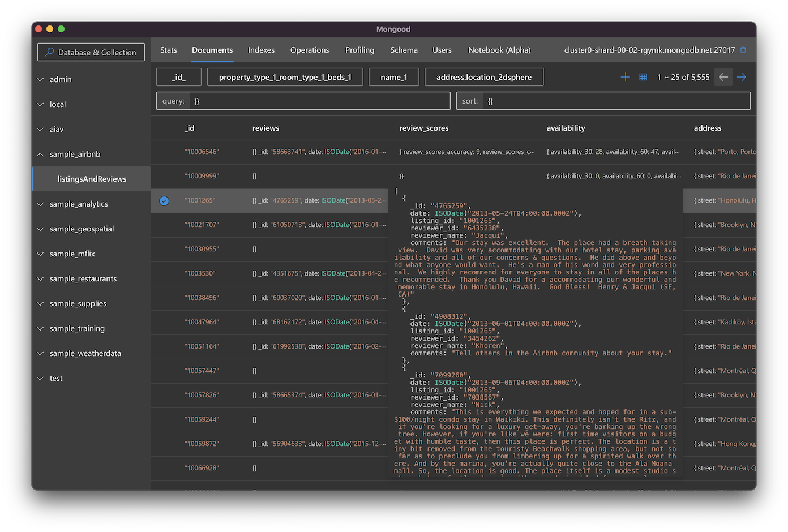

# Mongood

A [MongoDB](https://www.mongodb.com/) GUI with [Fluent Design](https://www.microsoft.com/design/fluent/)

[](https://app.codacy.com/manual/RenzHoly/Mongood?utm_source=github.com&utm_medium=referral&utm_content=RenzHoly/Mongood&utm_campaign=Badge_Grade_Dashboard)
[](https://opensource.org/licenses/MPL-2.0)
[](https://hub.docker.com/r/renzholy/mongood)

[](https://www.codefactor.io/repository/github/renzholy/mongood)
[](https://codeclimate.com/github/RenzHoly/Mongood/maintainability)

English | [简体中文](./README-zh_CN.md)

## Download ⚡️

- [Run as Client](https://github.com/RenzHoly/Mongood/releases)
- [Run as Server](https://hub.docker.com/r/renzholy/mongood)

## Feature 🔮

- [x] Server or client mode (without Electron, but need Chrome)
- [x] Edit documents with [Monaco Editor](https://microsoft.github.io/monaco-editor/index.html)
- [x] Designed with [Microsoft Fluent UI](https://developer.microsoft.com/en-us/fluentui)
- [x] [Mongo Shell](https://docs.mongodb.com/manual/core/shell-types/) compatiable data type, eg: `ObjectId()` `ISODate()` `Timestamp()`
- [x] Find documents with index hint, avoiding slow operation
- [x] Fancy profiling exec stats
- [x] Geo preview for 2dsphere index
- [x] [JSON Schema Validator](https://docs.mongodb.com/manual/reference/operator/query/jsonSchema/) supporting
- [x] Notebook function, just like [Jupyter](https://jupyter.org/)
- [x] HTTP/2
- [x] Auto **dark** mode

## Screenshot 📷

<table>
  <tr>
    <td align="center"> Database status</td>
    <td align="center"> Find & sort with index</td>
  </tr>
  <tr>
    <td align="center"> Geo preview</td>
    <td align="center"> Document mode</td>
  </tr>
  <tr>
    <td align="center"> Edit with Monaco Editor</td>
    <td align="center"> Dragable multi-selection</td>
  </tr>
  <tr>
    <td align="center"> Documents export</td>
    <td align="center"> Indexes managment</td>
  </tr>
  <tr>
    <td align="center"> Analyse profiling</td>
    <td align="center"> Edit JSON Schema</td>
  </tr>
  <tr>
    <td align="center"> Notebook (Beta)</td>
    <td align="center"> Dark mode</td>
  </tr>
</table>

## Development 👨‍💻

### Frontend

```bash
npm ci
npm run dev
```

### Backend

```bash
cd go
go run main.go headless.go
```

## Roadmap 🚧

- [ ] Role management
- [ ] Performance moniting
- [ ] VSCode plugin

Feel free to pull request or create a issue !
